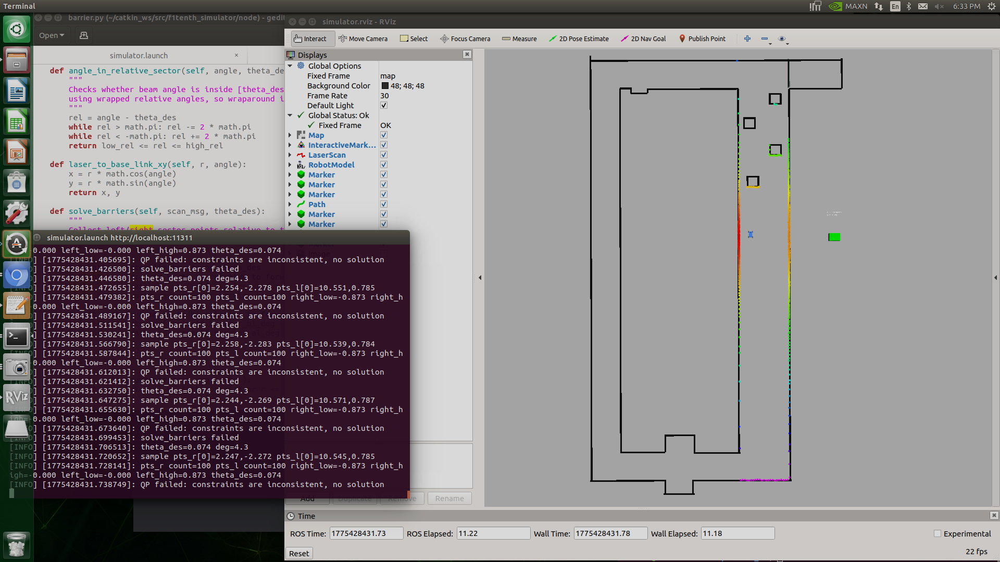

# Autonomous Electric Vehicle 🏎️

This system enables real-time autonomous navigation for the **McMaster Autonomous Electrified Vehicle (AEV)** using LiDAR, IMU, RGB-D camera, and odometry data within a ROS-based framework. Developed as part of ELECENG 3EY4, the project integrates localization, mapping, and control algorithms to navigate structured and unstructured environments.

The system runs on an **NVIDIA Jetson Nano**, handling real-time sensor processing, state estimation, mapping, and control.

---

## 🎥 Demo

### Real-World Testing
<p align="center">
  
</p>

### RViz Visualization
<p align="center">
  
</p>

### Hardware Setup
<p align="center">
  
  
  
</p>

---


## Technologies Used

- **ROS (Robot Operating System)**: Middleware managing nodes, topics, messages, and TF transforms  
- **Python & C++**: ROS node implementation for mapping, navigation, and control  
- **NumPy**: Numerical computation and matrix operations  
- **RViz**: Visualization of LiDAR scans, coordinate frames, and maps  
- **QuadProg**: Solves QP for virtual barrier-based obstacle avoidance  
- **NVIDIA Jetson Nano**: Embedded platform for real-time autonomous processing  
- **LiDAR (RPLiDAR A2M8)**: 2D obstacle detection and mapping  
- **IMU (BNO055)**: Orientation (yaw) and motion data  
- **RGB-D Camera (Intel RealSense)**: Depth-based obstacle detection (bonus integration)  
- **Odometry (VESC + IMU fusion)**: Vehicle pose and velocity estimation  

---

## Features

### Localization (Lab 6)
- Implements **wheel odometry with IMU yaw fusion**  
- Estimates vehicle pose:
\[
X = [x \; y \; \theta]^T
\]
- Uses discrete-time kinematics for real-time updates  
- Publishes pose via ROS Odometry messages and TF transforms  

---

### Mapping (Lab 6)
- Implements **Occupancy Grid Mapping** using LiDAR and pose data  
- Uses an **inverse sensor model** to classify space as:
  - Occupied  
  - Free  
  - Unknown  
- Applies **log-odds updates** for probabilistic mapping  
- Publishes map as `nav_msgs/OccupancyGrid`  

---

### ROS System Architecture
- Nodes:
  - `occupancygridmap.py` → mapping  
  - `navigation.py` → navigation + control  
  - `barrier.py` → QP-based obstacle avoidance  

- Topics:
  - `/scan` → LiDAR data  
  - `/odom` → vehicle pose  
  - `/imu/data` → orientation  
  - `/drive` → control commands  

- TF Frames:
  - `odom` (global frame)  
  - `base_link` (vehicle frame)  
  - `laser`, `imu`, `camera` (sensor frames)  

---

### Line-Following Control (Lab 7)
- Estimates distances to left and right walls using LiDAR  
- Computes error:
\[
d_{lr} = d_l - d_r
\]
- Uses **feedback-linearizing + PD control** to maintain centered motion  

---

### Gap-Based Navigation (Lab 7)
- Identifies the **largest free-space gap** within the forward field of view  
- Selects safe heading for navigation in cluttered environments  

---

### Virtual Barrier Method (Lab 7)
- Constructs **parallel virtual barriers** using LiDAR data  
- Formulated as a **Quadratic Program (QP)**  
- Solved using **QuadProg** to generate a safe navigation corridor  

---

### ⭐ Bonus: RGB-D Camera Integration
- Uses depth images to detect obstacles outside the LiDAR plane  
- Converts depth data into 3D points and filters ground noise  
- Projects relevant obstacles into the LiDAR frame  
- Enhances obstacle detection without modifying the core navigation pipeline  

---

### Control & Safety
- Uses `AckermannDriveStamped` for steering and velocity commands  
- Velocity adjusted based on obstacle distance  
- Ensures smooth and stable real-time navigation  

---

## Project Files

- `navigation.py` → Navigation logic and control (gap selection + steering)  
- `barrier.py` → QP-based virtual barrier obstacle avoidance  
- `occupancygridmap.py` → Probabilistic occupancy grid mapping  
- `simulator.launch` → Launches the simulation environment  
- `experiment.launch` → Runs full system setup  
- `params.yaml` → Configuration and tuning parameters  

---

## How to Run

### 1. Setup ROS Workspace

```bash
git clone <repo-link>
cd ~/catkin_ws
catkin_make
source devel/setup.bash
```

---

### 2. Launch Simulation

```bash
roslaunch simulator.launch
```

---

### 3. Run Navigation Node

```bash
rosrun navigation.py
```

---

### 4. Visualize in RViz

- Set fixed frame to `odom`
- Add:
  - TF
  - LaserScan
  - OccupancyGrid

---

## Summary

This project demonstrates a complete autonomous driving pipeline for the **McMaster AEV**, combining:

- Localization (odometry + IMU)  
- Probabilistic mapping (occupancy grid)  
- Control systems (feedback-linearizing + PD)  
- Optimization (QP-based virtual barriers)  
- Sensor fusion (LiDAR + RGB-D camera)  

All components work together in real time within ROS to enable safe and reliable autonomous navigation.
